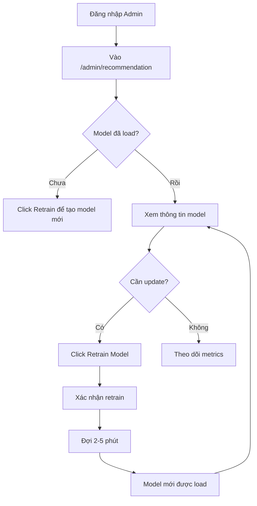

# 🤖 Admin Recommendation System Management

Trang quản lý hệ thống gợi ý sách cho Admin.

## 📋 Tổng quan

Trang **Admin Recommendation** cho phép quản trị viên:
- 📊 Xem thông tin chi tiết về model đang hoạt động
- 🔄 Retrain lại model với dữ liệu mới
- 📈 Theo dõi trạng thái training real-time
- 🎯 Quản lý Collaborative Filtering & Content-Based models

## 🚀 Cách sử dụng

### 1. Truy cập trang

Đăng nhập với tài khoản **ADMIN**, sau đó:

```
http://localhost:3000/admin/recommendation
```

Hoặc click vào **"Hệ thống gợi ý"** trong sidebar Admin.

### 2. Xem thông tin Model

Dashboard hiển thị:

#### 📊 Model Overview (4 metrics):
- **Hybrid Alpha**: Tỷ lệ kết hợp giữa CF và Content-Based (0.0 - 1.0)
- **Status**: Trạng thái model (Loaded / Not Loaded)
- **CF Users**: Số lượng users trong Collaborative Filtering model
- **Content Books**: Số lượng sách trong Content-Based model

#### 🧠 Collaborative Filtering Model:
- Number of Users: Số users đã có tương tác
- Number of Items: Số sách đã có tương tác
- Matrix Non-Zero Elements: Số phần tử khác 0 trong ma trận user-item
- Density: Mật độ ma trận (% phần tử được điền)

#### 📚 Content-Based Model:
- Number of Books: Số sách được vector hóa
- Feature Dimension: Số chiều của vector đặc trưng

### 3. Retrain Model

#### Khi nào cần Retrain?
- ✅ Có nhiều user mới đăng ký
- ✅ Thêm nhiều sách mới vào hệ thống
- ✅ Có nhiều tương tác mới (favorites, ratings, reading history)
- ✅ Định kỳ mỗi tuần/tháng để cập nhật xu hướng

#### Cách Retrain:

1. Click nút **"Retrain Model"** (màu đỏ, góc trên bên phải)

2. Xác nhận trong popup:
   ```
   ⚠️ Xác nhận retrain model
   
   Quá trình này sẽ:
   - Tải lại toàn bộ dữ liệu từ database
   - Huấn luyện lại Collaborative Filtering model
   - Huấn luyện lại Content-Based model
   - Thay thế model hiện tại bằng model mới
   
   Thời gian ước tính: 2-5 phút
   ```

3. Theo dõi tiến trình:
   - Trạng thái sẽ chuyển sang **"Đang retrain..."**
   - Alert màu xanh hiển thị progress bar
   - Trang tự động refresh mỗi 3 giây

4. Hoàn thành:
   - Alert biến mất
   - Model info được cập nhật với dữ liệu mới
   - Status trở lại **"Hoạt động bình thường"**

## 🔧 Technical Details

### API Endpoints được sử dụng:

```javascript
// Backend RS API: http://localhost:8001/api/v1

// 1. Health Check
GET /health
Response: { status: "ok" | "retraining", models_loaded: boolean }

// 2. Model Info
GET /model/info
Response: {
  alpha: number,
  cf_model: { num_users, num_items, matrix_nnz },
  content_model: { num_books, feature_dim },
  is_retraining: boolean
}

// 3. Trigger Retrain
POST /retrain
Response: { status: "accepted", message: "..." }
```

### Service Layer:

Tất cả API calls được xử lý qua `recommendationService.js`:

```javascript
import {
  getHealthStatus,
  getModelInfo,
  triggerRetrain
} from '../../services/recommendationService';

// Usage
const info = await getModelInfo();
const health = await getHealthStatus();
await triggerRetrain();
```

### Auto-Refresh Logic:

```javascript
// Tự động refresh khi đang retrain
useEffect(() => {
  let interval;
  if (autoRefresh || healthStatus?.status === 'retraining') {
    interval = setInterval(loadModelInfo, 3000); // 3s
  }
  return () => clearInterval(interval);
}, [autoRefresh, healthStatus?.status]);
```

## 📊 Model Architecture

### Hybrid Recommender System:

```
Recommendation = α × CF_score + (1-α) × Content_score
```

Với:
- **α (alpha)**: Tỷ trọng của Collaborative Filtering (mặc định: 0.7)
- **CF_score**: Điểm từ Collaborative Filtering (dựa trên hành vi user)
- **Content_score**: Điểm từ Content-Based (dựa trên đặc trưng sách)

### Collaborative Filtering:
- **Input**: User-Item interaction matrix (favorites, ratings, history)
- **Algorithm**: Matrix Factorization (SVD/ALS)
- **Output**: User embeddings + Item embeddings

### Content-Based:
- **Input**: Book features (title, author, genres, description)
- **Algorithm**: TF-IDF + Cosine Similarity
- **Output**: Book similarity matrix

## 🎨 UI Components

### Dependencies:
- **Ant Design (antd)**: Card, Button, Statistic, Alert, Modal, Progress, Tag, Spin
- **Lucide React**: Icons (Brain, Reload, Info, etc.)
- **Axios**: HTTP client

### Responsive Design:
- **Desktop (≥992px)**: 4 columns layout
- **Tablet (768-991px)**: 2 columns layout
- **Mobile (<768px)**: 1 column layout

### Color Scheme:
- Primary: `#1890ff` (Blue)
- Success: `#52c41a` (Green)
- Warning: `#fa8c16` (Orange)
- Danger: `#ff4d4f` (Red)
- Processing: `#722ed1` (Purple)

## 🚨 Error Handling

### Các trường hợp lỗi:

1. **Model Not Loaded**:
   ```jsx
   <Alert 
     type="warning" 
     message="Model chưa được load"
     description="Hệ thống chưa có model. Vui lòng retrain để tạo model mới."
   />
   ```

2. **Retrain Already in Progress**:
   ```javascript
   // HTTP 409 Conflict
   { detail: "Retraining already in progress" }
   ```
   Button "Retrain Model" sẽ bị disable khi đang retrain.

3. **API Connection Error**:
   ```javascript
   message.error('Không thể tải thông tin model');
   ```

4. **Retrain Failed**:
   - Backend sẽ log error
   - `is_retraining` flag reset về `false`
   - Model cũ vẫn hoạt động bình thường

## 📝 Logs & Monitoring

### Backend Logs (FastAPI):

```python
logger.info("🔄 Starting model retraining...")
logger.info("📊 Loading data from database...")
logger.info(f"Loaded {len(books_df)} books, {len(interactions_df)} interactions")
logger.info("🤖 Training new hybrid model...")
logger.info("💾 Saving new model to {artifacts_dir}...")
logger.info("♻️ Replacing old model with new model...")
logger.info("✅ Model retraining completed successfully!")
```

### Frontend Logs (Console):

```javascript
[RS API] POST /retrain
[RS API] Response: 200 { status: "accepted", message: "..." }
```

## 🔒 Security Notes

### Production Checklist:
- [ ] Thêm authentication cho endpoint `/retrain`
- [ ] Kiểm tra role ADMIN trước khi cho phép retrain
- [ ] Rate limiting cho retrain endpoint
- [ ] Logging audit trail cho mọi retrain action
- [ ] Alert admin khi retrain fail

### Suggested Implementation:

```python
# Backend: src/api/routes.py
@router.post("/retrain")
async def trigger_retrain(
    background_tasks: BackgroundTasks,
    current_user: User = Depends(get_current_admin)  # ← Add this
):
    if current_user.role != "ADMIN":
        raise HTTPException(status_code=403, detail="Admin access required")
    
    # ... rest of code
```

## 📖 User Guide

### Workflow hoàn chỉnh:



### Best Practices:

1. **Retrain định kỳ**: Mỗi tuần hoặc khi có ≥100 tương tác mới
2. **Theo dõi density**: Nếu density < 0.1%, cần thu thập thêm dữ liệu
3. **Kiểm tra logs**: Xem backend logs để debug nếu retrain fail
4. **Backup model**: Model cũ được giữ lại trong lúc train model mới
5. **Test recommendations**: Sau khi retrain, test API `/recommendations` để verify

## 🐛 Troubleshooting

### Issue 1: "Model chưa được load"

**Nguyên nhân**: 
- Artifacts directory không tồn tại
- Model chưa được train lần đầu

**Giải pháp**:
```bash
# 1. Kiểm tra artifacts directory
ls models/artifacts/

# 2. Nếu chưa có, trigger retrain lần đầu từ UI
# Hoặc train từ script:
cd recommendation-system
python scripts/train.py
```

### Issue 2: Retrain không hoàn thành

**Nguyên nhân**:
- Không đủ dữ liệu (< 10 users hoặc < 10 books)
- Database connection error
- Out of memory

**Giải pháp**:
```bash
# 1. Kiểm tra logs backend
tail -f logs/app.log

# 2. Kiểm tra database
psql -U postgres -d bookdb
SELECT COUNT(*) FROM users;
SELECT COUNT(*) FROM books;
SELECT COUNT(*) FROM favorites;
SELECT COUNT(*) FROM ratings;
SELECT COUNT(*) FROM reading_history;

# 3. Kiểm tra memory
free -h
```

### Issue 3: API connection error

**Nguyên nhân**:
- RS backend không chạy (port 8001)
- CORS error

**Giải pháp**:
```bash
# 1. Check RS backend
curl http://localhost:8001/api/v1/health

# 2. Restart RS backend
cd recommendation-system
python -m uvicorn src.main:app --host 0.0.0.0 --port 8001 --reload

# 3. Check CORS config trong src/main.py
app.add_middleware(
    CORSMiddleware,
    allow_origins=["*"],  # ← Make sure this includes frontend URL
    allow_credentials=True,
    allow_methods=["*"],
    allow_headers=["*"],
)
```

## 🎯 Next Steps

### Features để thêm:

1. **Model Comparison**:
   - So sánh model trước/sau retrain
   - A/B testing
   - Performance metrics (precision, recall, NDCG)

2. **Scheduled Retraining**:
   - Cron job tự động retrain
   - Configurable schedule (daily, weekly, monthly)

3. **Data Insights**:
   - Top interacted books
   - Most active users
   - Interaction trends over time

4. **Model Versioning**:
   - Lưu history của các models
   - Rollback về model cũ
   - Compare model versions

5. **Real-time Monitoring**:
   - Model latency
   - Prediction accuracy
   - User feedback tracking

## 📚 Related Files

```
frontend/
├── src/
│   ├── pages/Admin/
│   │   └── AdminRecommendation.jsx    ← Main component
│   ├── services/
│   │   └── recommendationService.js    ← API service
│   ├── constant/
│   │   └── routePath.jsx               ← Routes
│   ├── components/admin/
│   │   └── AdminSidebar.jsx            ← Navigation
│   └── App.jsx                         ← Route config

backend-rs/
└── src/
    ├── api/
    │   └── routes.py                   ← API endpoints
    └── main.py                         ← FastAPI app
```

## 📞 Support

Nếu có vấn đề, check:
1. Backend logs: `logs/app.log`
2. Frontend console: Browser DevTools
3. Database status: `psql`
4. RS API health: `http://localhost:8001/api/v1/health`

---

**Created by**: Team 6 - Book Recommendation System
**Last Updated**: November 2025
